  

<h1 align="center">
Hi, I'm Farid
</h1>

<h3 align="center">
Fullstack Developer | Laravel · NestJS · React · Next.js · TypeScript
</h3>

<!-- 

  

 -->

## 👨‍💻 About Me

I'm a Fullstack Developer with 3+ years of experience building and maintaining web applications, enterprise HRMS platforms, recruitment systems, and RESTful APIs.

My work spans backend services, modern frontend applications, database-driven workflows, authentication, system integrations, and production troubleshooting.

Currently, I work at Jobseeker, contributing to enterprise HRMS and Career Site platforms.

- 💼 Fullstack Developer at Jobseeker
- 🌱 Currently building HRMS & Career Site platforms
- 🚀 Passionate about scalable backend architecture and modern frontend development
- 💡 Interested in Laravel, NestJS, React, Next.js, TypeScript
- 📍 Bali, Indonesia

## 🚀 What I Do

- Build and maintain enterprise HRMS and recruitment platforms
- Design and integrate RESTful APIs and backend services
- Build responsive web applications with React.js and Next.js
- Implement authentication, authorization, validation, and business logic
- Design and work with relational and document databases
- Troubleshoot production issues across frontend, backend, APIs, and databases
- Collaborate with product and engineering teams to deliver production-ready features

## 🚀 Featured Projects

### 🏢 ATS & Recruitment Platform

Enterprise recruitment platform supporting candidate management, job vacancies, applications, recruitment workflows, and end-to-end hiring processes.

**Key Features**
- Candidate registration and profile management
- Job vacancy and position management
- Candidate application and recruitment workflows
- Candidate search, filtering, and screening
- Resume and document management
- Candidate pipeline and application status tracking
- Authentication, authorization, and role-based access
- RESTful APIs integrations
- Multi-tenant recruitment workflows

**Tech**  
Laravel • NestJS • React • TypeScript • MySQL • REST APIs

---

### 🌐 Career Site Platform *(Professional Project)*

A modern recruitment platform integrated with an Applicant Tracking System (ATS).

**Key Features**
- Candidate registration
- Job discovery and application
- ATS integration
- Candidate profile and document management
- Application notifications
  
**Tech**
Laravel • React • REST APIs • MySQL

---
> These are professional projects I contributed to while working at Jobseeker. Source code and internal implementation details are proprietary.
---

### 💈 Barber Management System
A web-based management system for barber shops featuring appointment scheduling, customer management, service tracking, employee management, and sales reporting.

**Tech**  
Laravel • React • Tailwind CSS • MySQL

**Live App** → https://maskot-barbershop.vercel.app/

---

### 🎓 Learning Management System (LMS)
An online learning platform that allows instructors to manage courses, lessons, assignments, and student progress through an intuitive web interface.

**Tech**  
Laravel • React • MySQL • REST APIs

---

## 💼 Professional Experience

### Fullstack Developer - Jobseeker
**Sep 2024 - Present**

Contribute across backend services, frontend applications, APIs, databases, integrations, and production support for enterprise web applications.

**Key Contributions**
- Develop and maintain production web applications using Laravel, React.js, TypeScript, and MySQL
- Build and integrate RESTful APIs supporting recruitment and HR workflows
- Implement authentication, authorization, validation, and database-driven business logic
- Develop responsive frontend interfaces using React.js and Next.js
- Integrate frontend applications with backend services and third-party systems
- Diagnose and resolve frontend, backend, APIs, database, and production issues
- Collaborate with Product, QA, and engineering teams within Agile development cycles
- Support testing, deployment, and post-release production activities

**Platforms I've Contributed To**
- Superindo
- FIT HUB
- Taekwang
- Mitra Keluarga
- Paramount Land

## Tech Stack

### Backend

### Frontend

### Database

### Tools

  
  
  
  
  

Thanks for visiting!
Let's build something awesome together.
